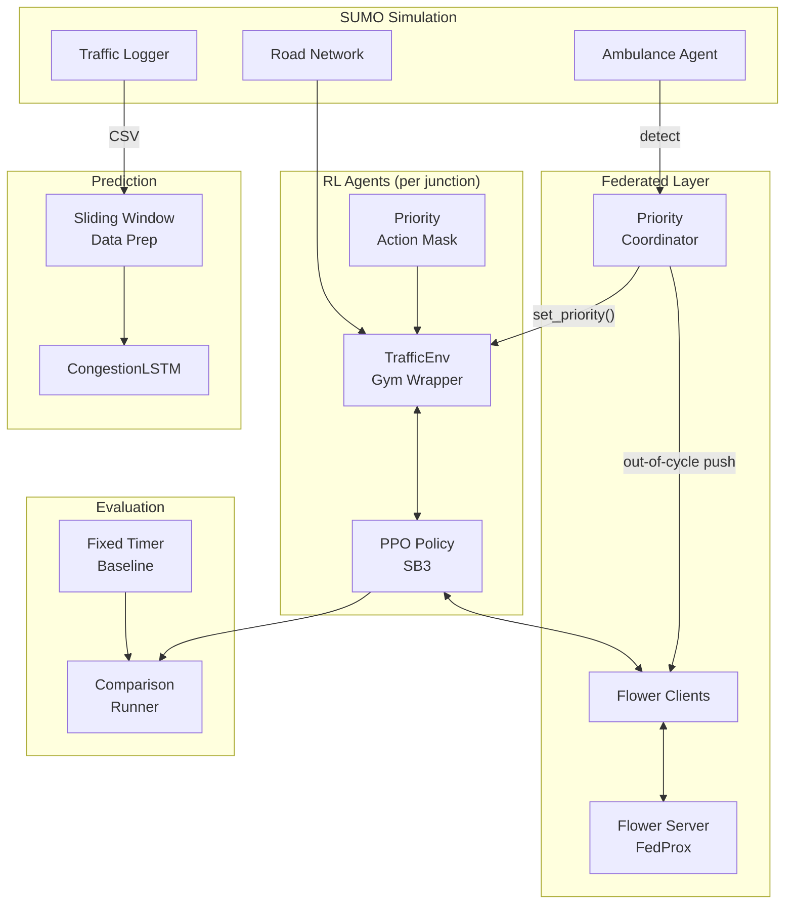

# MAESTRO-FL

**Federated Reinforcement Learning for Adaptive Traffic Signal Control with Emergency Vehicle Priority**

A federated learning system that trains per-intersection PPO agents for traffic signal control, coordinated via FedProx aggregation, with a novel out-of-cycle emergency priority trigger that bypasses the standard FL round schedule to give ambulances immediate green corridors.

## Architecture



## Quick Start

```bash
# 1. Run setup (installs SUMO, creates venv, installs deps)
bash setup.sh

# 2. Activate virtual environment
source .venv/bin/activate

# 3. Generate SUMO network (opens browser)
cd $SUMO_HOME/tools && python osmWebWizard.py
# Copy generated files to sumo_env/network/

# 4. Test the priority trigger spike (no SUMO needed)
python -m federated.priority_trigger

# 5. Train LSTM on synthetic data (no SUMO needed)
python -m prediction.train_lstm --synthetic

# 6. Train PPO (requires SUMO network)
python -m rl_agent.train_ppo --junction J1 --sumo-cfg sumo_env/network/osm.sumocfg

# 7. Start FL server
python -m federated.server --rounds 20 --mu 0.1

# 8. Run comparison
python -m eval.run_comparison --junction J1 --sumo-cfg sumo_env/network/osm.sumocfg
```

## Module Overview

| Module | Purpose | Key Files |
|--------|---------|-----------|
| `shared/` | Data schemas (locked day one) | `schema.py` |
| `sumo_env/` | SUMO simulation interface | `ambulance.py`, `logger.py` |
| `rl_agent/` | PPO training + Gym wrapper | `traffic_env.py`, `train_ppo.py`, `priority_mask.py` |
| `prediction/` | LSTM congestion forecasting | `lstm_model.py`, `train_lstm.py`, `data_prep.py` |
| `federated/` | FL coordination + emergency trigger | `client.py`, `server.py`, `priority_trigger.py` |
| `eval/` | Baselines + comparison plots | `baseline_fixed_timer.py`, `run_comparison.py` |

## The Novel Contribution

Standard Flower FL operates in synchronous rounds. MAESTRO-FL adds an **out-of-cycle priority trigger**:

1. SUMO detects an ambulance approaching a corridor of junctions
2. `ambulance.py` builds a `PRIORITY_MESSAGE` with downstream junction IDs
3. `PriorityCoordinator` immediately pushes the current global model to those junctions
4. Each junction's `TrafficEnv` activates its priority action mask
5. The PPO agent is overridden to give green to the ambulance's approach lane

This happens **outside** the normal FL round schedule — no waiting for the next aggregation round.

## Experimental Conditions

| # | Condition | Description |
|---|-----------|-------------|
| 1 | Fixed Timer | 30s cycle, ignores traffic state |
| 2 | PPO Only | Single-agent RL, no federation |
| 3 | PPO + FedProx | Federated RL, no emergency priority |
| 4 | **MAESTRO-FL** | Full system with priority trigger |

## Week-by-Week Plan

### Week 1
- [x] Lock `shared/schema.py`
- [ ] SUMO network + ambulance injection working standalone
- [ ] PPO trains on dummy/random traffic
- [ ] FedProx client/server running with dummy clients
- [ ] LSTM tested on synthetic data
- [ ] **Spike priority trigger in isolation** (`python -m federated.priority_trigger`)

### Week 2
- [ ] Real traffic logs from SUMO
- [ ] PPO training on real network
- [ ] LSTM training on real logs
- [ ] Wire real models into FedProx
- [ ] **Full integration**: ambulance → priority → action mask → model push

### Week 3
- [ ] Run all 4 conditions
- [ ] Collect metrics, generate plots
- [ ] Build report with privacy comparison figure
- [ ] Buffer days (protected from scope creep)

## Key Metrics

- **Emergency vehicle travel time** (biggest expected win)
- **Average waiting time** across all vehicles
- **Queue length** over time
- **Communication cost** (centralized GPS vs. our compact messages)
- **FedProx convergence** with/without priority trigger
- **Throughput** (vehicles completing trips)
